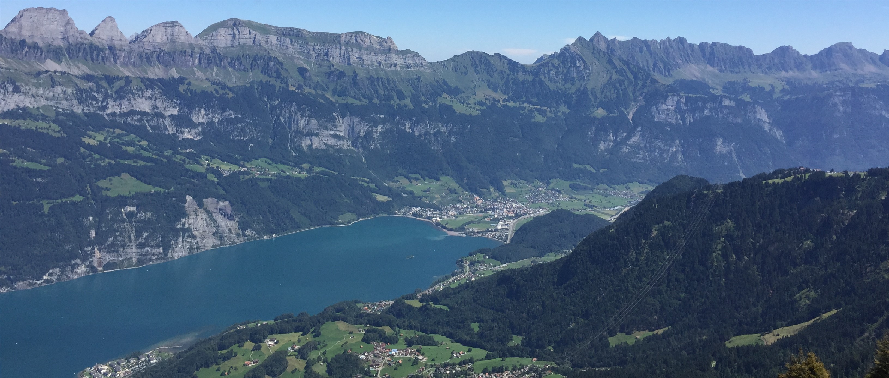

# Joel Sahli - Personal CV & Portfolio Website

A modern, professional personal website showcasing skills, experience, and selected work as a Fullstack Software Engineer.

## 🎨 Design Rationale

This redesign implements a **sapphire-themed rebrand** that balances modern professionalism with subtle web-developer personality. The design features:

- **Primary Color**: Sapphire (#0F52BA) - a professional blue that conveys trust and technical expertise
- **Swiss Landscape**: Full-bleed Swiss Churfirsten mountain range image as a visual anchor
- **Typography**: Inter for clean, modern body text and headings; Fira Code for monospace code snippets and tech badges
- **Accessibility-First**: WCAG 2.1 AA compliant with keyboard navigation, focus states, and reduced-motion support

## 🚀 Quick Start

### Prerequisites
- Node.js 18+ and npm installed

### Installation

```bash
# Install dependencies
npm install

# Run development server
npm run dev

# Build for production
npm run build

# Preview production build
npm run preview
```

The development server will start at `http://localhost:5173` (or the next available port).

## 🎨 Customization Guide

### Changing the Primary Color (Sapphire)

The sapphire color is defined in two places for consistency:

1. **CSS Variables** in `src/style.css` (lines 10-14):
```css
:root {
  --color-sapphire: #0F52BA;        /* Main sapphire color */
  --color-sapphire-hover: #0B46A0;  /* Darker hover state */
  --color-sapphire-border: #0D4AA8; /* Border variant */
  --color-sapphire-light: #1E5FCC;  /* Lighter variant */
}
```

2. **Tailwind Config** in `tailwind.config.js` (lines 7-12):
```js
colors: {
  sapphire: {
    DEFAULT: '#0F52BA',
    hover: '#0B46A0',
    border: '#0D4AA8',
    light: '#1E5FCC',
  },
}
```

**To change the color**: Update both files with your new color values, maintaining the same hover/border/light variants.

### Replacing the Swiss Landscape Image

The Swiss mountain image is in the "About Me" section (`index.html`, lines 106-124).

**Current image**: `assets/img/churfirsten-big.jpg`

**To add responsive, high-resolution images**:

1. Prepare three image sizes:
   - `swiss-highres.jpg` - 1920px wide (for large displays)
   - `swiss-medium.jpg` - 1280px wide (for tablets/small laptops)
   - `swiss-small.jpg` - 768px wide (for mobile devices)

2. Place images in `assets/img/` folder

3. Uncomment and update the `<picture>` element in `index.html` (lines 111-114):
```html
<picture class="absolute inset-0">
  <source media="(min-width: 1920px)" srcset="assets/img/swiss-highres.jpg">
  <source media="(min-width: 1280px)" srcset="assets/img/swiss-medium.jpg">
  <source media="(min-width: 768px)" srcset="assets/img/swiss-small.jpg">
  
</picture>
```

4. Update the `alt` text to describe your new image

### Changing Fonts

Fonts are imported in `src/style.css` (lines 3-6) and defined in `tailwind.config.js` (lines 15-20).

**Current fonts**:
- Body/Headings: Inter
- Monospace: Fira Code

**To change**:
1. Update the Google Fonts import URLs in `src/style.css`
2. Update the `fontFamily` configuration in `tailwind.config.js`

### Updating Personal Information

Edit `index.html` to update:
- **Profile image**: Line 89 - `src="assets/img/joel-cv.jpeg"`
- **Contact email**: Lines 27, 78, 221 - `contact@joelsahli.ch`
- **Name and tagline**: Lines 56-62
- **About me text**: Lines 139-153
- **Project cards and modal content**: Projects section and `src/main.ts`
- **Skills**: Lines 252-306
- **Career timeline**: Lines 336-446

## 📁 Project Structure

```
joey-cv/
├── assets/
│   └── img/               # Images (profile, project screenshots, Swiss landscape)
├── src/
│   ├── style.css          # Main stylesheet with CSS variables and utilities
│   └── main.ts            # TypeScript entry point
├── index.html             # Main HTML file
├── tailwind.config.js     # Tailwind CSS configuration
├── tsconfig.json          # TypeScript configuration
├── package.json           # Dependencies and scripts
└── README.md              # This file
```

## 🎯 Features

- ✅ Modern sapphire color scheme with accessible contrast ratios (≥4.5:1)
- ✅ Responsive design - mobile-first approach
- ✅ Semantic HTML with ARIA labels for screen readers
- ✅ Keyboard navigation with visible focus states
- ✅ `prefers-reduced-motion` support - respects user accessibility preferences
- ✅ Lazy-loading images with `loading="lazy"`
- ✅ Skip-to-main-content link for keyboard users
- ✅ Swiss landscape showcase section with `<picture>` element
- ✅ Monospace tech badges with Fira Code font
- ✅ Animated gradient borders (with reduced-motion fallback)
- ✅ Smooth scrolling (when not reduced-motion)

## 🔧 Technology Stack

- **Framework**: Vite 6.2 (fast build tool and dev server)
- **Language**: TypeScript 5.7
- **Styling**: Tailwind CSS 4.0 (utility-first CSS framework)
- **Fonts**: Inter (Google Fonts), Fira Code (Google Fonts)

## ♿ Accessibility

This site follows WCAG 2.1 Level AA guidelines:

- Color contrast ratios meet 4.5:1 minimum
- All interactive elements are keyboard accessible
- Focus states are clearly visible
- Images have descriptive alt text
- Semantic HTML structure with proper heading hierarchy
- ARIA labels for improved screen reader support
- Respects `prefers-reduced-motion` user preference

## 📝 Branch Information

**Branch**: `redesign/sapphire-rebrand`
**Base Branch**: `develop`

### Commits Made

1. `feat: introduce Tailwind CSS v4 config with sapphire color tokens`
2. `feat: add CSS variables for sapphire theme and accessibility features`
3. `feat: redesign hero section with CTA buttons and code snippet`
4. `feat: implement responsive Swiss showcase section with picture element`
5. `feat: update all sections with sapphire branding and improved semantics`
6. `refactor: clean up main.ts and add accessible smooth scrolling`
7. `docs: update README with comprehensive customization instructions`

## 🧪 Testing Checklist

### Responsiveness
- [ ] Test on mobile devices (320px - 768px)
- [ ] Test on tablets (768px - 1024px)
- [ ] Test on desktop (1024px+)

### Keyboard Navigation
- [ ] Tab through all interactive elements
- [ ] Verify visible focus states (sapphire outline)
- [ ] Test skip-to-main-content link

### Accessibility
- [ ] Test with screen reader (NVDA/JAWS/VoiceOver)
- [ ] Verify color contrast with browser tools
- [ ] Test with `prefers-reduced-motion` enabled
- [ ] Check image alt text

### Cross-Browser
- [ ] Chrome/Edge
- [ ] Firefox
- [ ] Safari

## 📧 Contact

For questions or collaboration opportunities, reach out at [contact@joelsahli.ch](mailto:contact@joelsahli.ch)

---

Built with ♥ in Switzerland
